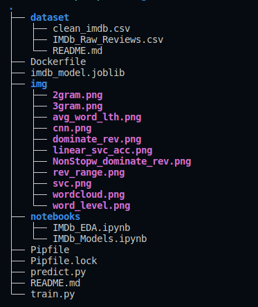
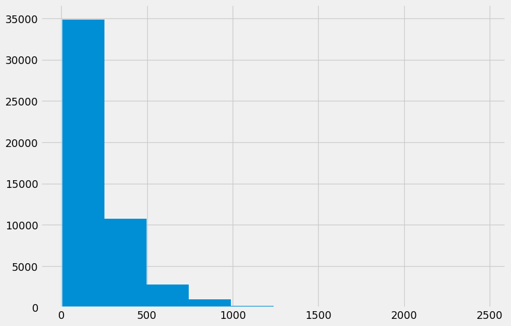
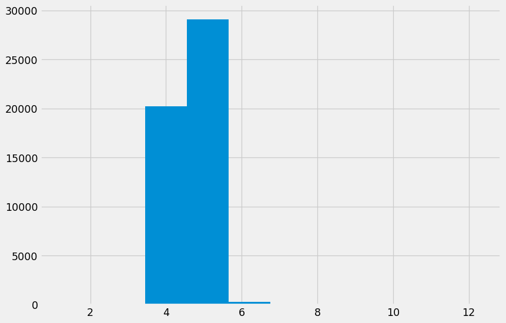
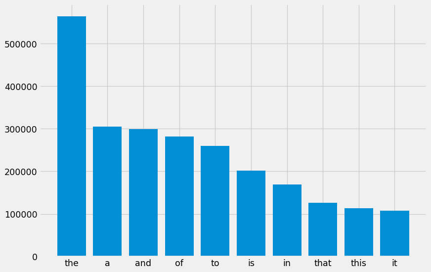
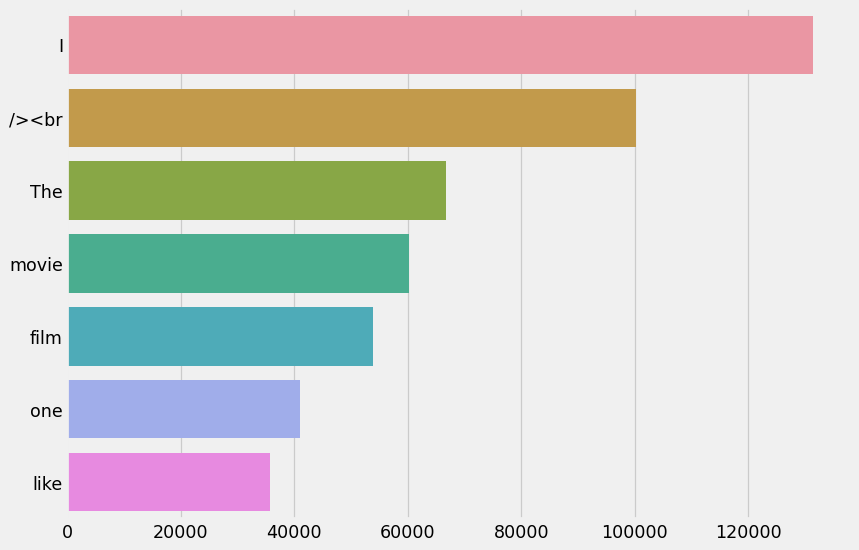
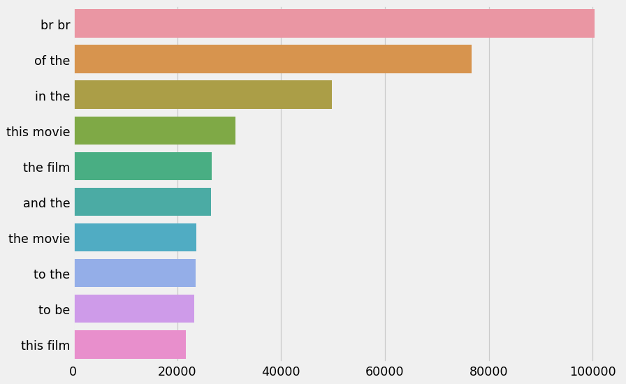
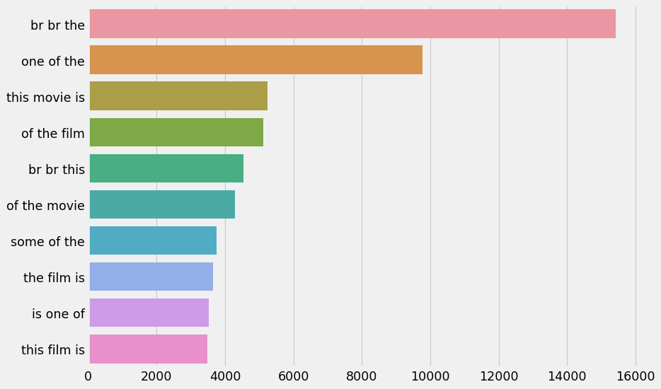
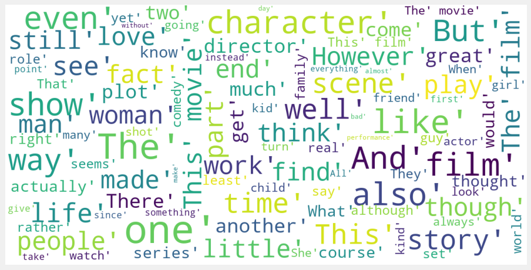
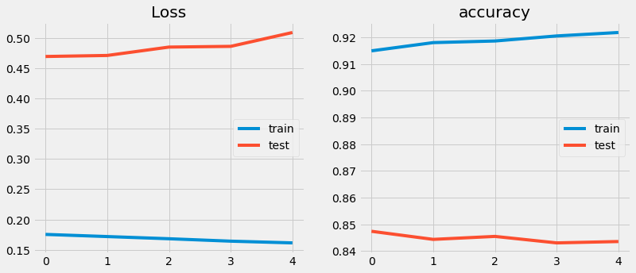
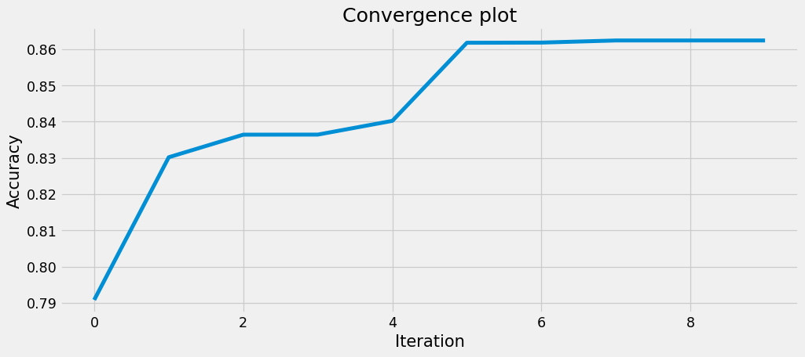

# ML Zoomcamp Capstone 2: IMDb movies sentiment analysis

Using sentiment analysis to classify documents based on their polarity. In particular, this project works with a dataset of 50,000 movie reviews from the Internet Movie Database (IMDb) and build a predictor that can distinguish between positive and negative review.

 # Dataset

This [project](https://ai.stanford.edu/~amaas/data/sentiment/) uses a dataset with more than **`50,000`** reviews provided by Maas and others.

# Overview
This dataset contains movie reviews along with their associated binary sentiment polarity labels. It is intended to serve as a benchmark for sentiment classification. This document outlines how the dataset was gathered, and how to use the files provided.

### Files
* `imdbEr.txt`
* `imdb.vocab`
* `README`
* `train`
* `test`

# Contents of the folder 
  
# Exploratory Data Analysis
See the [IMDb_EDA.ipynb](./notebooks/IMDb_EDA.ipynb) for this task.

### Analyzing text statistics
**Reviews range**  
  
The histogram shows that reviews range from 0 to 7000 characters and generally, it is between 0 to 3000 characters.

Now, we will move on to data exploration at a word-level. Let’s plot the number of words appearing in each review.  

**Word level**  
  
It is clear that the number of words in reviews ranges from 0 to 1000 and mostly falls between 0 to 500 words.

Let’s check the average word length in each sentence.  

**average word length**  
  
The average word length ranges between 4 to 7 with 5 being the most common length. Does it mean that people are using really short words in reviews? Let’s find out.

One reason why this may not be true is stopwords. Stopwords are the words that are most commonly used in any language such as "the", "a", "an" etc. As these words are probably small in length these words may have caused the above graph to be left-skewed.

Analyzing the amount and the types of stopwords can give us some good insights into the data.  

**Dominate words**  
  
We can evidently see that stopwords such as "the", "a" and "and" dominate in reviews.

So now we know which stopwords occur frequently in our text, let’s inspect which words other than these stopwords occur frequently.  

**Dominate words other than stop words**  
  
Since the dataset is not yet cleaned up, the "br" space and tags appear with words such as film and movie.  

### Ngram exploration
Ngrams are simply contiguous sequences of n words. For example "movies", "The best movie" etc.If the number of words is two, it is called bigram. For 3 words it is called a trigram and so on.

Looking at most frequent n-grams can give us a better understanding of the context in which the word was used.  

**Analyze the top bigrams in our reviews.**   
  

We can observe that the bigrams such as "this movie", "this film" that are related to movies dominate the reviews.

How about trigrams?  
  
Same as the bigrams.  

### Topic modeling exploration
Topic modeling is the process of using unsupervised learning techniques to extract the main topics that occur in a collection of documents.
Latent Dirichlet Allocation (LDA) is an easy to use and efficient model for topic modeling. Each document is represented by the distribution of topics and each topic is represented by the distribution of words.
Once we categorize our documents in topics we can dig into further data exploration for each topic or topic group.  
Instead of print all the topics and try to make sense of them, there are tools that can help us run this data exploration more efficiently. One such tool is [pyLDAvis](https://github.com/bmabey/pyLDAvis) which visualizes the results of LDA interactively.To see that interaction, please open the [IMDb_EDA.ipynb](./notebooks/IMDb_EDA.ipynb) with [jupyter nbviewer](https://nbviewer.org/).  

### Wordcloud

Wordcloud is a great way to represent text data. The size and color of each word that appears in the wordcloud indicate it’s frequency or importance.  
  


# Models
See the [IMDb_Models.ipynb](./notebooks/IMDb_Models.ipynb) for this task.
## Summary of the models
| Models | Accuracy % |
|:---|:---|
|DummyClassifier|50.2|
|LogisticRegression|86.3|
|LinearSVC|86.3|
|GaussianNB|81.6|
|MultinomialNB|83.7|
|RandomForestClassifier|83.1|
|GradientBoostingClassifier|80.9|
|HistGradientBoostingClassifier|84.5|
|XGBClassifier|80.7|
|CNN model|92.8|
|LSTM model|50.2|


Although the CNN model displays an accuracy of 92%, unfortunately it does not learn anything since it presents overfitting since the first epochs as shown in the following graph:
  

Regarding the long short term memory model (LSTM), it does not manage to exceed the dummy classifier and displays an accuracy of **50%**.  

After the optimization of the three candidate models, namely, [LinearSVC, MultinomialNB, XGBClassifier], the best model and the LinearSVC with a score of more than **86%**:
 

# Deployment of model
 I am using Streamlit on linux ubuntu, in order to deploy the model. To deploy this model with Sreamlit, please use:
  ```console
  pipenv run streamlit run predict.py
  ```

# Virtual Environment/venv 

I used pipenv for the virtual environment. In order to use the same venv as me, do use: 
```console 
pip install pipenv
```
To replicate the environment, on your command line, use 
```console
pipenv install scikit-learn pandas numpy streamlit bs4 nltk
```  


# Docker

**Note**:  
To perform the following steps you should logon to your DockerHub Account ( `Login & Password`)

I have built the model and pushed it to [dajebbar/imdb-model](https://hub.docker.com/u/dajebbar). 
To use it just 
```console
docker pull dajebbar/imdb-model:latest
```

Or in order to take the model from the docker container I built, just replace 
```Dockerfile
FROM python:3.9-slim 

#with 

FROM dajebbar/imdb-model:latest 
```  
in the dockerfile.


If you choose to build a docker file locally instead, here are the steps to do so:
1. Create a Dockerfile as such:
```Dockerfile
FROM python:3.9-slim

ENV PYTHONUNBUFFERED=TRUE

RUN pip --no-cache-dir install pipenv

WORKDIR /app

COPY ["Pipfile", "Pipfile.lock", "./"]

RUN pipenv install --deploy --system && rm -rf /root/.cache

COPY ["predict.py", "imdb_model.joblib", "./"]

EXPOSE 8501

ENTRYPOINT [ "streamlit", "run" ]

CMD ["predict.py"]
```

This allows us to `install python, run pipenv and its dependencies, run our predict script and our model itself and deploys our model using streamlit`.

Similarly, you can just use the dockerfile in this repository.

2. Build the Docker Container with :
```console
 docker build -t imdb-model .
 ```

3. Run the Docker container with:

```console
docker run --rm --name imdb -p 8501:8501 imdb-model
```

4. tag the docker container with:

```console

docker tag imdb-model dajebbar/imdb-model:latest

```
5. Push it to Docker registry with :

```console
docker push dajebbar/imdb-model:latest

```
# Test the project

A quick demo of the web app can be found [here](https://youtu.be/AacgwUcIxu8).  

# Want to Contribute?
* Fork 🍴 the repository and send PRs.
* Do ⭐ this repository if you like the content.


**Connect with me:**

<p align="center">
  <a href="https://ma.linkedin.com/in/abdeljebbar-boubekri-656b30192" target="blank"></a>
  <a href="https://www.twitter.com/marokart/" target="blank"></a>
  <a href="https://www.kaggle.com/dajebbar" target="blank">
    </a>
</p>
